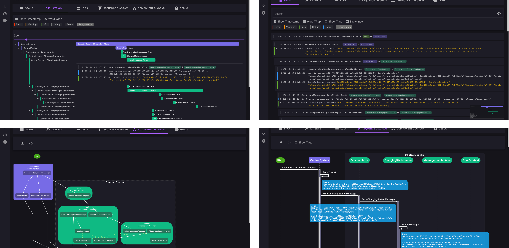

# TraceView



> **Note**<br>
> TraceView is **NOT** opensource<br>
> TraceView is **NOT** free for commercial usage<br>
> TraceView **IS** free for personal use.

TLDR; What is TraceView?<br>
TraceView is an OpenTelemetry logging and tracing visualizer with developer focus instead of SRE/DevOps focus.<br>
_See the right data instead of "a lot of data".<br>_

TraceView is also an OpenTelemetry Collector for ingesting and storing data<br>


## Deployment

### Docker Compose 

#### Linux AMD64 Distro: 
* [docker-compose.yml](amd64/docker-compose.yml)
* TraceView UI: http://localhost:5001
* OpenTelemetry (gRPC) Collector: http://localhost:4317

#### Linux ARM64 Distro:
* [docker-compose.yml](arm64/docker-compose.yml)
* TraceView UI: http://localhost:5001
* OpenTelemetry (gRPC) Collector: http://localhost:4317

### Docker

>**Note**<br>
>Requires access to Redis

#### Linux AMD64 Distro: 
```
docker run -p 5001:5001 -p 4317:4317 docker.io/rogeralsing/traceview:amd64
```

* TraceView UI: http://localhost:5001
* OpenTelemetry (gRPC) Collector: http://localhost:4317

#### Linux ARM64 Distro: 
```
docker run -p 5001:5001 -p 4317:4317 docker.io/rogeralsing/traceview:arm64
```

* TraceView UI: http://localhost:5001
* OpenTelemetry (gRPC) Collector: http://localhost:4317

#### Configuration

TraceView uses the following configuration block to access Redis

```json
"Redis": {
    "Server": "host.docker.internal",
    "Port": 6379,
    "Ssl": false,
    "CertificatePath": "",
    "UseCaCertificate": false
}
```

These settings can be overridden using environment variables like so:

```bash
docker run -p 5001:5001 -p 4317:4317 --env Redis__Server=RedisIp docker.io/rogeralsing/traceview:amd64
```


## Data Privacy

TraceView does not share data, all data is stored in your own Redis instance.

**TraceView does however use PlantUML for rendering diagrams**. all data required to render the diagrams will be sent to a 3rd party PlantUML Server.


## EULA

TRACEVIEW IS IN EARLY ALPHA. IT IS NOT YET READY FOR PRODUCTION USE.

THE SOFTWARE IS PROVIDED "AS IS", WITHOUT WARRANTY OF ANY KIND, EXPRESS OR IMPLIED, INCLUDING BUT NOT LIMITED TO THE WARRANTIES OF MERCHANTABILITY, FITNESS FOR A PARTICULAR PURPOSE AND NONINFRINGEMENT. IN NO EVENT SHALL THE AUTHORS OR COPYRIGHT HOLDERS BE LIABLE FOR ANY CLAIM, DAMAGES OR OTHER LIABILITY, WHETHER IN AN ACTION OF CONTRACT, TORT OR OTHERWISE, ARISING FROM, OUT OF OR IN CONNECTION WITH THE SOFTWARE OR THE USE OR OTHER DEALINGS IN THE SOFTWARE.

NO REVESRE ENGINEERING, YOU MAY NOT, AND YOU AGREE NOT TO OR ENABLE OTHERS TO, COPY (EXCEPT AS EXPRESSLY PERMITTED BY THIS LICENSE OR BY THE USAGE RULES IF THEY ARE APPLICABLE TO YOU), DECOMPILE, REVERSE ENGINEER, DISASSEMBLE, ATTEMPT TO DERIVE THE SOURCE CODE OF, DECRYPT, MODIFY, OR CREATE DERIVATIVE WORKS OF THE ASYNKRON SOFTWARE OR ANY SERVICES PROVIDED BY THE ASYNKRON SOFTWARE, OR ANY PART THEREOF.
