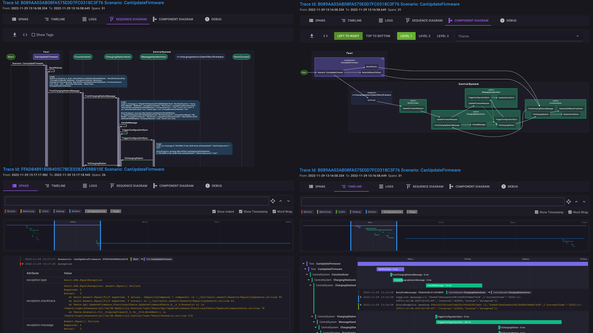

# TraceLens



## Terms of Use

During beta, TraceLens is free to use for everyone.

After beta, TraceLens will be free for personal use and OSS projects. A subscription model will be available for commercial use after beta. details are undecided yet.

Summary:

TraceLens is an OpenTelemetry logging and tracing visualizer that focuses on providing developers with relevant data, rather than overwhelming them with a large quantity of information. It also acts as an OpenTelemetry Collector for ingesting and storing data.

## Deployment

### Docker Compose 
:
* [docker-compose.yml](docker-compose.yml)
* TraceLens UI: http://localhost:5001
* OpenTelemetry (gRPC) Collector: http://localhost:4317

### Docker

>**Note**<br>
>Requires access to Postgres, it will use the public free PlantUml server for rendering diagrams

```bash
docker run -p 5001:5001 -p 4317:4317 docker.io/rogeralsing/tracelens:latest
```

* TraceLens UI: http://localhost:5001
* OpenTelemetry (gRPC) Collector: http://localhost:4317

#### Configuration

These settings can be overridden using environment variables like so:

```bash
docker run -p 5001:5001 -p 4317:4317 --env ConnectionStrings__DefaultConnection=PostgresConnStr docker.io/rogeralsing/tracelens:latest
```

Example connection string:

```bash
USER ID=tracelens;PASSWORD=tracelens;HOST=host.docker.internal;PORT=5432;DATABASE=tracelens;POOLING=true;
```

## Data Privacy

TraceLens is committed to protecting the privacy of our users. We do not share any data collected through our platform. All data is stored in your own Redis instance, ensuring that you maintain control over your information.

In order to render diagrams, we utilize PlantUML. When using our provided Docker Compose files, a local PlantUML server will be started and all necessary data will be sent to this server for rendering. This ensures that your data remains securely within your own environment.

Using a standalone docker container, you can configure this setting using this environment variable:

`--env PlantUml__RemoteUrl = yourplantumlurl`


## EULA

TraceLens IS IN EARLY BETA. IT IS NOT YET READY FOR PRODUCTION USE.

THE SOFTWARE IS PROVIDED "AS IS", WITHOUT WARRANTY OF ANY KIND, EXPRESS OR IMPLIED, INCLUDING BUT NOT LIMITED TO THE WARRANTIES OF MERCHANTABILITY, FITNESS FOR A PARTICULAR PURPOSE AND NON-INFRINGEMENT. IN NO EVENT SHALL THE AUTHORS OR COPYRIGHT HOLDERS BE LIABLE FOR ANY CLAIM, DAMAGES OR OTHER LIABILITY, WHETHER IN AN ACTION OF CONTRACT, TORT OR OTHERWISE, ARISING FROM, OUT OF OR IN CONNECTION WITH THE SOFTWARE OR THE USE OR OTHER DEALINGS IN THE SOFTWARE.

NO REVESRE ENGINEERING, YOU MAY NOT, AND YOU AGREE NOT TO OR ENABLE OTHERS TO, COPY (EXCEPT AS EXPRESSLY PERMITTED BY THIS LICENSE OR BY THE USAGE RULES IF THEY ARE APPLICABLE TO YOU), DECOMPILE, REVERSE ENGINEER, DISASSEMBLE, ATTEMPT TO DERIVE THE SOURCE CODE OF, DECRYPT, MODIFY, OR CREATE DERIVATIVE WORKS OF THE ASYNKRON SOFTWARE OR ANY SERVICES PROVIDED BY THE ASYNKRON SOFTWARE, OR ANY PART THEREOF.
